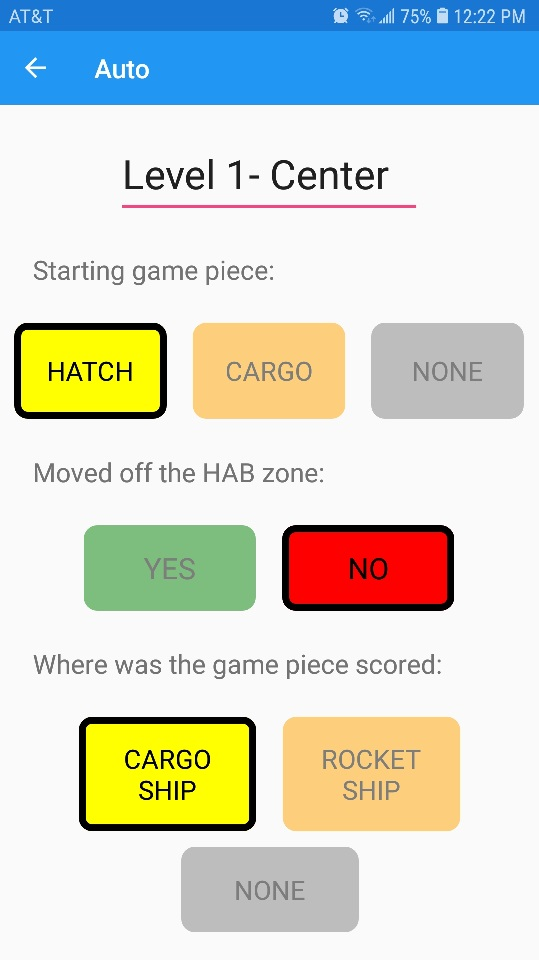

# ScoutingDemo

## Description

A demo for a FRC scouting app using Microsoft's Xamarin

## Features

- Allows the user to input data about a match
- Enter autonomous data
- Enter teleop data
- Uses interactive methods to input data
- Makes sure the user has inputed all the required data before submitting
- Submits the data to a google spreadsheet

## Setup

- Install Visual Studio and then the Xamarin extension within it

## Examples

### Teleop Screen

### Auto Screen

